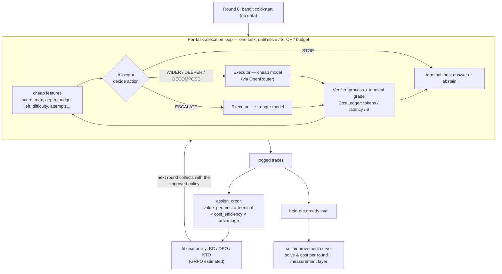
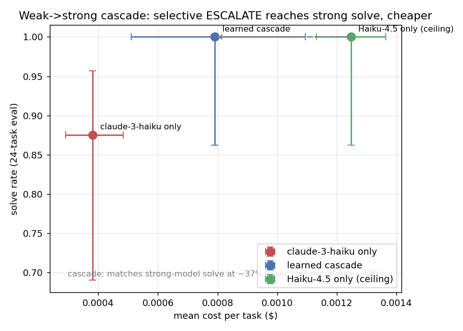

# self-improving-agentic-systems (wdp-controller)

[](https://github.com/kalyvask/self-improving-agentic-systems/actions/workflows/ci.yml)

A self-improving controller that decides how to spend the next unit of compute on
a tool-using agent task. At each decision node it picks one of four core actions:

- `WIDER`: spawn a fresh parallel Executor attempt from the current state
- `DEEPER`: continue and refine the current trajectory on tool feedback
- `DECOMPOSE`: hand the task to the Planner, producing a sub-task DAG
- `STOP`: stop spending and abstain (a safe non-attempt)

plus an optional fifth action, `ESCALATE` (hand the step to a stronger, pricier
model), enabled only for the weak->strong cascade experiment below.

**Why it matters.** As model labs move to token-based billing, *how* an agent spends
compute is becoming as load-bearing as whether it succeeds. Solving the same task for
half the tokens, escalating to a bigger model only on the tasks that need it, or
stopping instead of looping is real money at scale, and that gap widens the longer
agents run and the more they pay per token. So the controller is judged on **cost per
solved task**, not accuracy alone, with a measurement-rigor layer (Wilson and bootstrap
confidence intervals, McNemar, Rasch task difficulty, an alternative-annotator test on
the cheap verifier, and an oracle-rescue diagnostic that classifies every miss) so each
cost and solve-rate claim is resolved, not eyeballed.

Three live results, reported with their honest verdicts:
1. **Real text-to-SQL (the clearest one):** the loop learns an interpretable allocation
   strategy from its own traces — it shifts from writing SQL cold (cold-start 0–2/8) to
   schema-grounded DECOMPOSE (**5–6/8 across two seeds**) by round 2, at *lower* cost,
   graded by free execution-match.
2. **Weak->strong cascade (the resolved cost win):** a cheap model that retries once then
   escalates only what it still fails reaches a stronger model's solve rate at **36-47%
   lower mean cost across two seeds**, beating always-use-the-strong-model with a
   paired-cost CI that excludes zero.
3. **Single-model allocation (honest tie):** the learned policy is ~40% cheaper than the
   *exploring cold-start bandit* it begins from, but at this sample size it **ties the best
   fixed action** — a real self-improvement gain, not a win over the best hand-picked
   strategy. It is the *top* policy by solve where allocation genuinely matters, just not
   resolvably so.

And the boundaries we measured rather than hid: the cascade only saves cost when the cheap
model is capable enough (it does not on tau-bench retail); arithmetic with a calculator has
no capability ceiling; and a small agent eval is usually underpowered, so cost (paired) is
the metric we lean on, not solve.

The controller (the Allocator) is a small, CPU-trainable policy over cheap numeric
features, not a fine-tuned LLM. Executors are frontier models called through
OpenRouter. The expensive part is collecting traces; the policy update is cheap.
The Allocator learns from its own logged traces, so the headline result is a
self-improvement curve: collect traces with the current policy, fit the next
policy from those traces, measure, repeat.

## How self-improvement works here



1. Round 0: the `BanditAllocator` cold-starts with no data (Thompson sampling over
   per-action value-per-cost) and collects traces.
2. Each later round: fit a fresh `BCAllocator`, `DPOAllocator`, or `KTOAllocator`
   on all accumulated traces, run it to collect more traces, and evaluate it on a
   held-out task set.
3. The per-round scoreboard (solve rate, mean / p95 cost, generation-verification
   gap) is the self-improvement curve.

Three learners share one small linear-softmax policy core, so any difference
between them is attributable to the learning objective, not model capacity:

- `BanditAllocator`: Thompson sampling; works with zero training data.
- `BCAllocator`: behavior-cloning. Keeps the top fraction of traces by realized
  value-per-cost, then clones features to action, weighted by per-decision credit.
  Correct STOPs survive the filter, so it also learns when not to spend.
- `DPOAllocator`: preference learning. Fits a BC reference, mines preference pairs
  from realized value-per-cost, then runs the DPO objective against that
  reference.
- `KTOAllocator`: unpaired preference learning. Tags each decision desirable or
  undesirable by its value-per-cost and optimizes the Kahneman-Tversky objective
  against the same BC reference, so it needs no preference pairs. This is the more
  data-efficient option in the small-trace regime, where good pairs are scarce.

Credit per decision is `terminal_reward * cost_efficiency * advantage`, where
`cost_efficiency = exp(-cost_weight * spent/budget)` keeps decaying past budget so
a cheap solve trains as strictly better than an expensive one. That cost signal is
only sharp when the budget is set near the typical task spend; far above it the
term is flat and the policy is effectively cost-blind.

GRPO is estimated, not run. The loop logs the per-call token and wall cost GRPO
would need, so the GRPO cost and expected ceiling are an extrapolation from
measured data rather than a guess.

## Baselines and positioning

A learned controller is only worth its complexity if it beats what you get without
learning. Three baselines make that test explicit (`scripts/fixed_baselines.py`):

- **Fixed-action policies** (`ConstantAllocator`): always-WIDER / DEEPER /
  DECOMPOSE / ESCALATE / STOP. The strongest single fixed action is the bar to
  clear; the script reports whether the learned controller *separates* from it
  (Wilson CIs on solve, McNemar on paired solves, a paired bootstrap CI on cost)
  and prints the honest null ("ties always-DEEPER at this n") when that is the
  truth.
- **Non-contextual online bandit** (`BanditAllocator`, v0): Thompson over
  per-action value-per-cost, the round-0 cold start.
- **Contextual online bandit** (`LinUCBAllocator`): disjoint LinUCB over the
  *same* 12 features and actions the trained policies use, learned online with no
  offline step. It asks the load-bearing question: *does offline BC -> DPO -> GRPO
  actually beat a cheap online contextual bandit on the same features and
  actions?* If it does, the offline machinery has earned its cost; if it ties,
  that is the headline.

**Offline vs online.** BC/DPO/KTO/GRPO are offline (fit once on accumulated
traces, stable, need a trace corpus). The bandits are online (update per decision,
adapt continually, no corpus). `LinUCBAllocator.fit()` warm-starts from logged
traces and keeps updating, and `save()` / `load()` persist the learned state, so a
deployed controller can keep improving session to session rather than being
trained once.

**Positioning.** This is a *learned, cost-aware policy at the compute-allocation
layer* -- not a self-rewriting agent, and a contextual-bandit / offline-RL
reduction rather than deep sequential RL (GRPO's group-relative advantage replaces
a learned critic). The learning objectives are textbook; the contribution is the
composition and the cost-per-solved objective. The full comparison against
compute-optimal inference (Snell et al.), Thompson tree search (AB-MCTS),
process-reward search, and inference-time routing, with the plain disclaimers, is
in [`docs/POSITIONING.md`](docs/POSITIONING.md).

## Cost currencies

Every LLM call is logged in three currencies at once, because the optimal
allocation policy depends on which one you are spending:

- tokens: prompt plus completion tokens
- latency: wall-clock seconds, where concurrent branches cost the max of their
  children, not the sum
- dollars: OpenRouter usage cost when available

## What we evaluate and why

The question is not "can the agent solve the task" but "does the controller spend
compute well, and does it get better at spending as it learns from its own
traces." That shapes the metrics. All of them live in `wdp/metrics`.

**Primary: success@budget, per currency.** Fraction of tasks solved when each task
is capped at a fixed budget in one currency, reported as a curve over budgets and
separately for tokens, latency, and dollars. This is the metric the project
optimizes because the whole thesis is that the best allocation policy depends on
which currency you are spending: a latency budget rewards parallel WIDER and
DECOMPOSE branches (billed as the max of concurrent children), while a token
budget rewards a frugal DEEPER refinement. A single cost-blind score would hide
that, so success is always paired with a budget and a currency.

**The self-improvement curve.** success@budget and cost, plotted per round across
the bandit cold-start then the BC/DPO rounds. If learning is working the curve
moves toward more solves at less spend relative to round 0. This is the headline
result, not any single-round number.

**pass^k (reliability), not pass@k (coverage).** pass^k is the fraction of tasks
where all k attempts succeed; it is the honest consistency metric for an agent you
would actually deploy, since users feel the worst case, not the best. pass@k (did
any of k succeed) is kept only as a diagnostic ceiling: it conflates generation
with selection and ignores cost, so a high pass@k with low pass^k means the
attempts exist but the controller cannot reliably pick or reach them. That gap is
the thing worth fixing, which is why both are reported.

**Generation-verification gap.** Mean absolute difference between the best process
score the Allocator could see mid-run and the ground-truth terminal reward. The
controller acts on the cheap process score but is graded on terminal reward, so a
large gap means selection (the verifier), not generation, is the bottleneck. It
also predicts how hard on-policy methods like GRPO would be to train, since their
advantages inherit verifier noise directly.

**Risk-coverage, from the STOP arm.** STOP is a deliberate abstention. Sorting the
answered (non-abstained) tasks by confidence and plotting accuracy against
coverage shows whether the controller knows when not to spend. A useful STOP arm
bends this curve upward: it abstains on the tasks it would have failed anyway.

**Tail cost: p95 and CVaR.** A policy can win on mean cost and still be
unshippable if its worst cases blow the budget. CVaR (mean of the worst tail) and
p95 capture that, so cost is judged on its tail, not just its average.

**METR task-horizon (stub).** The human-time length at which the agent crosses a
target reliability (default 50 percent). Included as an economic-value framing for
when tasks carry a human-time estimate; it is a stub until a benchmark supplies
those estimates.

## Measurement rigor

A small agent eval has very little statistical power, so a raw solve-rate
difference between two policies is easy to over-read. `wdp/metrics` makes the
uncertainty explicit and steers comparisons onto metrics that can actually resolve
a difference at the sample sizes these runs produce. `scripts/analyze_eval.py`
runs all of this offline on collected traces.

- **Reliability and power (`reliability.py`).** Wilson confidence intervals on
  every solve rate, the minimum detectable effect at the current sample size, the
  number of tasks needed to detect a target lift, McNemar on paired binary
  outcomes, and a paired bootstrap interval on per-task cost. At ten tasks the
  minimum detectable solve-rate difference is large, so cost (continuous, paired,
  low-variance) is the primary comparison and solve rate is read with its interval
  rather than as a point.
- **Item-response difficulty (`irt.py`).** A Rasch (1PL) fit over all responses
  gives a calibrated per-task difficulty and the Fisher information each task
  carries at the agent's ability, so a small eval can be chosen to be informative
  instead of drawn at random.
- **Verifier alt-test (`alt_test.py`).** The controller acts on a cheap process
  verifier. The alternative-annotator test turns "is this judge good enough to act
  on" into a pass/fail verdict against the ground-truth terminal verifier, rather
  than an uncalibrated agreement number.

## Results

**At a glance** (each result detailed below, with the bar it clears):

| result | benchmark | headline | resolved? |
|--------|-----------|----------|-----------|
| Self-improvement learns the right action | real text-to-SQL (free exec-match) | cold-start 0–2/8 → **5–6/8** eval solve (2 seeds), WIDER→DECOMPOSE, lower cost | directional (n=8/seed) |
| Weak→strong cascade | arithmetic (2 seeds) | matches strong-model solve at **36–47% lower mean cost**; beats always-strong | **yes** (paired CI excludes 0) |
| Single-model allocation | calibrated arithmetic | ~40% cheaper than the exploring cold-start; **ties** the best fixed action | tie at n=44 |

The three are described in turn; the honest boundaries (where it does *not* work) are collected in
[What we learned](#what-we-learned-and-where-it-does-not-work) at the end.

### Single-model allocation vs the cold-start baseline

**Self-improvement cuts cost without giving up accuracy.** The point of learning from
the agent's own traces here is to hold the solve rate while spending less, and that is what
happens. On the calibrated arithmetic suite (110 tasks, 44-task eval), after fixing a family of
credit/normalization/execution bugs and adding an abstention (STOP) rule calibrated to abstain
after 3 failed attempts, the learned DPO policy sits at **~$0.0018/task vs the cold-start *exploring*
bandit's ~$0.0030 — about 40% cheaper — at the same 0.84 solve rate** (the bandit it begins from
spends more because it samples expensive actions to explore). Accuracy is not the thing that
moves: paired solve is **0.841 vs 0.841**, statistically tied (McNemar p=1.0, neither side wins a
single task net), while the paired per-task cost delta is **−0.001 [−0.002, −0.001] (95% bootstrap
CI excludes 0 → resolved)**. Cost is the metric with power at n=44; the learned policy spends it
better, with a balanced WIDER/DEEPER/DECOMPOSE/STOP mix.


*Mean cost (x) vs solve rate (y), greedy eval. The learned DPO policy sits directly left of the
cold-start bandit at the same solve height — cheaper for the same outcome. Solve-rate error bars
are wide (Wilson, n=44); the resolved signal is on cost (paired), not solve.*

**The harder bar: does it beat the best FIXED action?** Beating the cold-start you began with is the
self-improvement curve; the sharper question is whether the learned policy beats the best strategy
you could pick *without learning at all*. Running every fixed action (always-WIDER / -DEEPER /
-DECOMPOSE / -STOP) plus the settled bandit and an online contextual LinUCB on the same held-out 44
tasks (`scripts/fixed_baselines.py --benchmark arithmetic`):

| policy | solve | mean cost | cost/solved |
|--------|-------|-----------|-------------|
| always-DECOMPOSE (best fixed) | 37/44 | $0.00191 | $0.00165 |
| always-DEEPER | 36/44 | $0.00185 | $0.00153 |
| always-WIDER | 36/44 | $0.00190 | $0.00159 |
| settled bandit | 36/44 | $0.00176 | $0.00143 |
| **learned DPO** | **36/44** | **$0.00171** | $0.00154 |
| always-STOP | 0/44 | $0 | inf |

**The learned controller does NOT separate from the best fixed action at n=44** — solve 36 vs 37
(McNemar p=1.0), and the paired cost delta straddles zero. DPO has the lowest *mean* cost of any
policy, but not resolvably so. Two honest reasons, both real: on this suite one attempt solves most
tasks, so the spend-actions are nearly interchangeable (all 36–37/44) and the allocation headroom is
thin; and n=44 is underpowered (see `metrics.reliability.tasks_needed`). So the ~40% above is a
genuine gain *over the exploring cold-start*, not evidence that learning beats the best hand-picked
fixed strategy — on this suite it **ties** it.

The tie above is partly a benchmark artifact (atomic-heavy, so the actions barely differ), so the
test was re-run on a **multi-part-heavy split where the action choice actually matters** (a single
attempt tends to drop a term on 5-part tasks, so DECOMPOSE should pay off). There the picture moves
toward the learned policy:

| policy (multi-heavy, 32-task eval) | solve | mean cost |
|------------------------------------|-------|-----------|
| always-WIDER | 24/32 | $0.00194 |
| always-DEEPER | 25/32 | $0.00188 |
| always-DECOMPOSE (best fixed) | 26/32 | $0.00183 |
| bandit / LinUCB | 27/32 | — |
| **learned DPO** | **28/32** | $0.00196 |

**On the allocation-sensitive split the learned DPO is the single best policy by solve rate** —
28/32, above every fixed action and both bandits. But it is *still not statistically resolved*:
28 vs 26 is a two-task gap (McNemar p=0.69), and resolving a ~6-point solve difference would take a
few hundred tasks per arm. So the honest verdict across both splits: the controller never loses to
the best fixed action, and *wins on the point estimate exactly where allocation matters*, but the
separation is not resolved at feasible n. The one learned result that **does** clear a fixed bar at
a resolved CI is the cascade below (beats always-use-the-strong-model, paired-cost CI excludes zero).

To be precise about what "same accuracy" means: the learned policy and the cold-start baseline
are compared head-to-head on the identical 44 tasks, and neither solves more than the other
(McNemar p=1.0). So self-improvement is not buying cost savings by quietly answering fewer tasks —
it answers the same ones for less. The abstain threshold was tuned by a k-sweep over
abstain-after-{2,3,4}: **k=3 is the operating point** because it holds solve at 0.84 (k=2 traded a
few solves down to ~0.77 for the same cost) while cutting premature stops to 1 of 7 (k=2 had 3;
k=4 over-conserves and gives the cost back). The one remaining ceiling is capability, not
allocation: solve tops out at ~0.84 (Haiku's own ability on this suite), and lifting it needs the
ESCALATE-to-a-stronger-model action below, since better allocation of one model cannot exceed
what that model can do.

### Second experiment: a weak→strong cascade (ESCALATE)

The first experiment spends one model's compute efficiently. The capstone adds a fifth action,
**ESCALATE** — hand the step to a stronger, pricier model — and asks the complementary question:
*can a learned controller run a cheap model and escalate only the tasks it can't do, to reach the
strong model's accuracy for less than always using it?* This is the production cascade pattern.

Getting an honest test bed took work: a measurement diagnostic (`analyze_eval.py --oracle`,
classifying every miss as premature-STOP / recoverable / capability-ceiling) showed the existing
benchmarks have **no capability ceiling** — Haiku-4.5 solves all of them with or without a
calculator, so escalation has nothing to add. The capability gap isn't in the tasks, it's in the
*model*: the cascade runs **claude-3-haiku** (cheap) and escalates to **Haiku-4.5** (strong) on a
no-calculator arithmetic tier where the cheap model genuinely fails a fraction.

Two findings, both from measurement catching a wrong default:

1. **A naive ESCALATE collapses to "always escalate"** — escalating at step 0 is a sure one-call
   solve, so the bandit locks onto it and the policy clones it, giving the strong model's cost with
   no saving. The fix is *semantic*: ESCALATE is a **rescue**, gated to fire only after the cheap
   model has attempted and missed (`n_children ≥ 1`). That one constraint is what makes escalation
   selective.
2. **The cascade only saves cost when the cheap model is both cheaper and capable enough.** An
   8B model at 0.17 single-attempt solve doesn't help (its retry cost ≈ one strong call, so
   always-escalate is genuinely near-optimal — the policy was right). claude-3-haiku at ~0.88 does.

With the rescue gate, a cheap retry before escalating (`--escalate-after 2`), and a calibrated
budget, the learned cascade **matches Haiku-4.5's solve rate at 36–47% lower MEAN cost across two
seeds**, escalating only ~29–38% of tasks:



| arm | solve | mean cost | tasks escalated |
|-----|-------|-----------|---------------|
| claude-3-haiku only (seed 0) | 0.88 | $0.00038 | — |
| **learned cascade (seed 0)** | **1.00** | **$0.00067** | **0.29** |
| Haiku-4.5 only (seed 0) | 1.00 | $0.00125 | — |
| learned cascade (seed 1) | 1.00 | $0.00076 | 0.38 |
| Haiku-4.5 only (seed 1) | 1.00 | $0.00120 | — |

Paired, 24-task eval, cascade vs Haiku-4.5-only, **both seeds**: solve **1.00 vs 1.00**
(McNemar p=1.0, tied), mean cost delta resolved cheaper (seed 0 **−0.001 [−0.001, −0.000]**, 47%;
seed 1 **−0.000 [−0.001, −0.000]**, 36%). The controller learned to try the cheap model, retry it
once, and escalate only on a second miss — reaching the strong model's accuracy for roughly half
its mean cost. Forcing the cheap retry (`escalate-after 2`) cut escalation from ~42% to ~29% and
raised the seed-0 saving from 37% to 47% versus escalating on the first miss.

Honest caveats:

- **The cheap model sometimes reaches the ceiling on its own.** On seed 1, claude-3-haiku alone
  solved 1.00 at $0.00039 — cheaper than the cascade. So the cascade's value is a **hedge**: it
  reliably reaches the strong model's accuracy at below-strong cost *without knowing in advance*
  whether the cheap model will get there. When the cheap model can, cheap-only is cheapest; the
  cascade still beats always-using-the-strong-model.
- **Mean cost, not tail.** The win is on average cost; an escalated task pays the cheap attempts
  plus the strong call, so the cost tail is heavier than strong-only. A tail-aware (CVaR) objective
  is future work.
- **The escalation trigger here is a free exact grader, not a validated cheap verifier.** On this
  arithmetic suite a failed cheap attempt scores exactly 0, so "did the cheap model fail" is known
  for free. On a task without a free grader you would need a cheap verifier whose reliability is
  established by the alt-test — that is what a tau-bench transfer would have to demonstrate.

(This is a separate experiment from the cost result above: a different cheap/strong model pair, not
mixed into the single-model numbers. `budget` here gates the loop *after* each action, so a single
multi-turn action can overshoot it — it shapes credit and caps further spend, but is not a strict
per-action cap.)

#### Transfer check: the same cascade on tau-bench (a real agent benchmark)

To see whether the cost win generalizes off the controlled arithmetic suite, the same
claude-3-haiku → Haiku-4.5 cascade was run on **tau-bench retail** (multi-turn, env-graded
customer-service tasks). It does **not** save cost there, and the reason is the boundary condition
the arithmetic experiment already identified:

| arm (tau retail, 8-task eval) | solve | mean agent cost | tasks escalated |
|---|---|---|---|
| learned cascade | 1.00 | $0.136 | 0.88 |
| Haiku-4.5 only | 1.00 | $0.118 | — |

Solve is tied (McNemar p=1.0); the paired mean-cost delta **straddles zero** (−0.018 [−0.055,
0.022]) — if anything the cascade is slightly *more* expensive. claude-3-haiku is too weak on tau
retail (it escalates 88% of tasks), so the cascade pays a cheap attempt *plus* the strong call on
nearly everything and lands at ≈ strong-only cost. This is the **same lesson the 8B model taught on
arithmetic**, now on a real benchmark: a weak→strong cascade only saves money when the cheap model
is capable enough to carry a real share of the load on that distribution (claude-3-haiku is, on
arithmetic; it is not, on tau retail). The mechanism itself transfers — ESCALATE runs end to end on
tau, including a true mid-conversation handoff (the strong model resumes the cheap model's live env
rather than restarting). Caveats: small eval (n=8, stochastic user simulator, so this is
directional not powered); **agent cost only** (the user-simulator's LLM turns run off-ledger).

#### Self-improvement on real text-to-SQL (a free, deterministic grader)

The cleanest "did learning change behaviour on a real task" demonstration. The SQL benchmark
(`--benchmark sql`) is a natural-language-question → SQL suite over a small e-commerce database,
graded by **execution match** (run the predicted and gold SQL, compare result sets) — a free,
deterministic reward, and the agent's only billable calls are its own (the SQL runs locally, so the
cost ledger is clean). Running the self-improvement loop (Haiku-4.5, 20 questions, 8-task held-out
eval):

| round | policy | eval solve (seed 0 / seed 1) | mean cost | what it does |
|-------|--------|------------------------------|-----------|--------------|
| 0 | bandit | 0/8 · 2/8 | ~$0.014 | mostly WIDER (write SQL cold) |
| 1 | dpo | 0/8 · 0/8 | ~$0.014 | still WIDER |
| 2 | dpo | **6/8 · 5/8** | **~$0.012** | **DECOMPOSE-heavy** (explore schema, then compose) |

The controller **learns an interpretable allocation lesson from its own traces**: writing SQL cold
(WIDER) solves little here, so by round 2 it shifts toward DECOMPOSE — ground the query in the schema
first — reaching 5–6/8 across two seeds *and* spending less, up from the cold-start bandit's 0–2/8.
The learned policy is genuinely deployable: `--save-policy` writes it and `serve_policy.py` loads it
frozen and returns `decompose` with no training or trace store. Caveats: n=8 eval/seed is small (wide
Wilson interval), execution-match is strict, and the round-1→round-2 path is non-monotonic (round 1
dipped to 0/8 both seeds before round 2 recovered) — so this is a directional, two-seed demonstration
that learning shifted the policy to the right action on a real task, not a powered benchmark number.

### What we learned (and where it does not work)

The boundaries are part of the result; surfacing them is what makes the wins credible.

- **Beat-the-best-fixed-action is the load-bearing bar.** A self-improvement curve only proves you
  beat the cold start you began with. The harder, honest question — does learning beat the best
  strategy you could pick *without* it — ties at the sample sizes here. We ran it
  (`scripts/fixed_baselines.py`) rather than leave it implied.
- **A cascade only saves cost when the cheap model is capable enough.** claude-3-haiku carries real
  load on arithmetic (→ 36–47% saving); an 8B model does not (its retry cost ≈ one strong call), and
  claude-3-haiku on tau-bench retail does not (it escalates ~everything, so the cascade ≈ strong-only).
- **Allocation only matters where the action choice changes the outcome.** On a calculator-equipped
  arithmetic suite one attempt solves most tasks, so every action ties and no learner can separate —
  a benchmark ceiling, not a controller failure. Text-to-SQL is the opposite: WIDER solves nothing,
  DECOMPOSE solves most, and the controller learns the difference.
- **Cost wins are on the mean; watch the tail.** Selective escalation lowers mean cost but can raise
  p95 (an escalated task pays cheap + strong). Both are reported.
- **Small agent evals are underpowered.** At n≈8–44 the minimum detectable solve difference is large,
  so cost (continuous, paired, low-variance) is the metric leaned on and solve is read with its
  interval, not as a point.

---

### Appendix: earlier history

Earlier powered sweep (pre-STOP-rule), 110 tasks (66 train / 44 eval), budget calibrated to
~2x the median task cost so the cost signal is active. Round 3 (final) eval:

| policy | solve | mean cost | notes |
|--------|-------|-----------|-------|
| bandit (round 0) | ~0.78 | ~0.0023 | Thompson cold start |
| BC   | 0.82 | ~0.0022 | clones the bandit; flat by design |
| DPO  | 0.82 | ~0.0022 | stable, robust across rounds |
| KTO  | 0.80 | ~0.0023 | stable after the credit fixes below |
| GRPO | 0.80 then collapses | -- | holds ~6 steps, then drifts (see below) |

The honest finding is about **objective robustness and what breaks it**, not a
single best learner. At n=44 the binary solve-rate differences are within noise
(minimum detectable effect ~+0.24); the learners sit together around 0.80-0.82 and
no learner yet shows a *resolved* cheaper-at-equal-solve win on this benchmark,
because one WIDER attempt already solves most tasks (thin allocation headroom).

What the sweep did surface, and what most of the work was, is a family of
**normalization / credit bugs that caused apparent "collapses"** -- each found by
asking why a result that should not happen did:

- **Cost-credit cap-flattening:** `min(1, spent/budget)` gave every over-budget
  trace the same credit, erasing the gradient against runaway spend.
- **KTO double-beta:** the implicit-reward sigmoid argument was scaled by beta
  twice, disabling KTO's saturation so probability mass drained onto STOP.
- **GRPO std-normalization:** dividing the group-relative advantage by a tiny
  all-solve-group std amplified cost jitter over the real solve/fail signal
  (fixed via Dr. GRPO mean-centering).
- **Abstention-credit asymmetry:** a correct abstention scored the maximum 1.0
  while a cost-discounted solve scored ~0.7, so abstaining looked better than
  solving; correct-STOP examples then dominated the value-weighted clone and the
  controller drifted to STOP. Fixed by scaling abstention credit below the solve
  scale.

After these fixes BC/DPO/KTO are stable and competitive. GRPO is the remaining
open case: the std fix roughly doubled its time-to-collapse but it still drifts to
a single cheap action, because a sharp per-rollout cost reward suppresses the
necessary-but-expensive action (DECOMPOSE) on the very tasks that need it, and
67% of its groups carry no outcome signal. The next step is DAPO-style dynamic
sampling (learn only from outcome-varying groups) plus a softer cost term.

### Figures

Generated offline from the collected traces and run logs (`python scripts/make_figures.py`).


*Solve rate and mean cost per round on the 44-task eval (post-fix). BC, DPO, and KTO
sit together near 0.80-0.82; the differences are within noise at this sample size,
and one WIDER attempt already solves most current tasks (thin headroom).*


*The apparent "collapses" were bugs. Left: GRPO still slides to ~0.52 even with the
std-normalization fix (the fix only delays it; dynamic sampling is the remaining
step). Right: KTO's round-3 collapse is fully resolved by the abstention-credit fix.*


*How each bug was caught: action-mix drift. The buggy KTO drifts to STOP across
rounds; the std-fixed GRPO still drifts to WIDER. One action taking over is the
collapse signature, and it is what localized every fix.*


*Measurement rigor. Per-arm solve (Wilson) and cost (bootstrap) 95% intervals on the
training-collection traces. They overlap heavily, so no learner shows a resolved win;
cost is the lower-variance metric. (Training-collection rates run below the greedy
eval curve above because collection explores.)*

## Layout

```
src/wdp/
  config.py            .env + YAML config loading
  cost/                per-call cost accounting in three currencies
  llm/                 OpenRouter chat client with usage-based cost
  allocator/           the policy core and policies:
                         policy.py  Action, NodeFeatures, BanditAllocator (v0),
                                    ConstantAllocator (fixed-action baselines)
                         linear.py  shared CPU-trainable linear-softmax core (+ save/load)
                         linucb.py  LinUCBAllocator (online contextual-bandit baseline)
                         bc.py      BCAllocator (behavior cloning)
                         dpo.py     DPOAllocator (preference learning)
                         kto.py     KTOAllocator (unpaired preference learning)
  verifier/            terminal (ground-truth) and process (cheap) scorers
  executor/            ReAct loop, tool protocol, Task/Trajectory types
  planner/             decomposability probe + sub-task DAG
  loop/                trace logging, credit assignment, round runner,
                       self-improvement driver
  metrics/             success@budget, pass^k, risk-coverage, CVaR, gen-verif gap
                         reliability.py  Wilson CIs, power, McNemar, paired bootstrap
                         irt.py          Rasch (1PL) task difficulty + information
                         alt_test.py     alternative-annotator test for the verifier
  benchmarks/          Benchmark protocol, local arithmetic suite, tau-bench adapter
  grpo/                GRPO cost estimator (measured per-rollout extrapolation)
tests/                 offline end-to-end tests (no key, no network)
scripts/               smoke_live, run_selfimprove, estimate_grpo,
                       analyze_eval, offline_ablations, run_calibrated_arith_sweep
config/default.yaml    models, budgets, allocator and loop settings
```

## Setup

```bash
pip install -e ".[dev]"
```

Paste your OpenRouter key into `.env` (get one at https://openrouter.ai/keys):

```
OPENROUTER_API_KEY=sk-or-...
```

## Run

Offline tests (no key, no network):

```bash
python -m pytest -q
```

Live single-task check (costs a few cents):

```bash
python scripts/smoke_live.py
```

Self-improvement curve on the local arithmetic benchmark (costs credits, one
Executor run per task per round). Set the budget near the typical task spend so
the cost signal is sharp:

```bash
python scripts/run_selfimprove.py --learner bc  --rounds 3 --budget 0.003
python scripts/run_selfimprove.py --learner dpo --rounds 3 --budget 0.003
python scripts/run_selfimprove.py --learner kto --rounds 3 --budget 0.003
```

The same loop runs against tau-bench retail or airline (multi-turn, env-graded):

```bash
python scripts/run_selfimprove.py --benchmark taubench --env retail \
    --n-tasks 8 --rounds 2 --budget 0.50
```

Analyze collected traces offline, no credits (paired A/B, IRT difficulty, verifier
alt-test, and the budget and difficulty ablations):

```bash
python scripts/analyze_eval.py --ab traces/calib_dpo.jsonl --irt traces/calib_*.jsonl
python scripts/analyze_eval.py --verifier traces/calib_*.jsonl
python scripts/offline_ablations.py --arith traces/calib_dpo.jsonl
```

GRPO cost estimate from collected traces (offline, no credits):

```bash
python scripts/estimate_grpo.py --traces traces/traces.jsonl
```

## Benchmarks

The repo ships a local `ArithmeticBenchmark` whose verifier is exact and free, so
a full self-improvement run is cheap enough to iterate on a laptop and large enough
to have statistical power. It mixes atomic tasks across a difficulty gradient,
multi-part decomposable tasks (two to four sub-results, where DECOMPOSE has a real
payoff), and underspecified tasks where STOP is the only good move.

A tau-bench adapter (`benchmarks/taubench.py`) implements the same `Benchmark`
protocol against the retail and airline domains: multi-turn, env-graded tasks with
a live LLM user simulator. It is the realism check; the arithmetic suite is where a
powered comparison is affordable. Other benchmarks (SWE-bench, ALFWorld) implement
the same protocol: tasks, tools, and a terminal verifier.
